## Spaceport API
API service for spaceport managing written on DRF.


## Installation

Python 3.11 must be already installed.

```shell
git clone https://github.com/Mazur-Mariia-Python/spaceport-service
python -m venv venv
venv\Scripts\activate
pip install -r requirements.txt
python manage.py makemigrations
python manage.py migrate
python manage.py runserver
``` 
## Check it out
* Get access token via /api/user/token/.

   ```shell
   login: astronaut1@spacemail.com
   password: astronaut123
   ``` 

## Getting access
* Create user via /api/user/register/.
* Get access token via /api/user/token/.

## Features

* JWT authenticated.
* Admin panel /admin/.
* Documentation is located at /api/doc/swagger/ and /api/doc/redoc/.
* Managing orders and tickets.
* Creating spaceships with spaceship types, spaceship crews.
* Creating spaceflights.
* Creating routs with spaceports.
* Adding planets.

## DB structure
   
  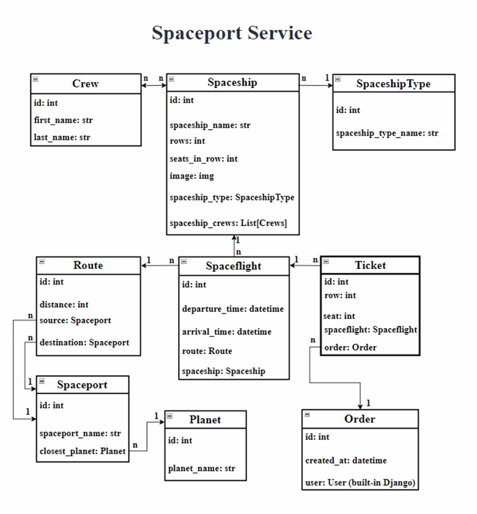

## Demo

Pages images:

1. Spaceship type list page.

   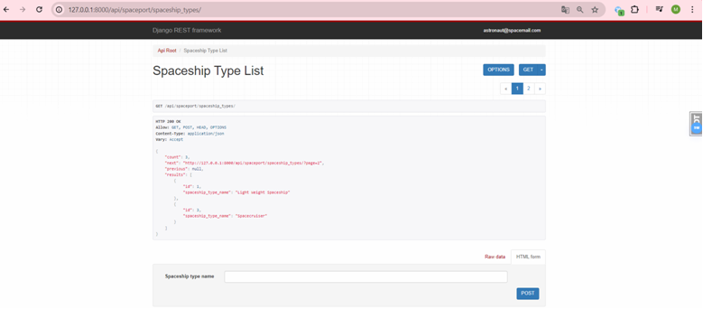

2. Spaceship type instance page.

   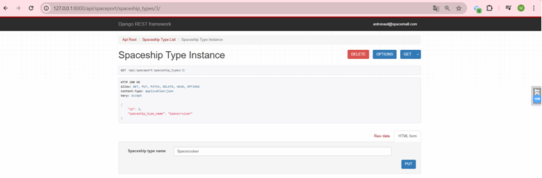

3. Crew list page.

   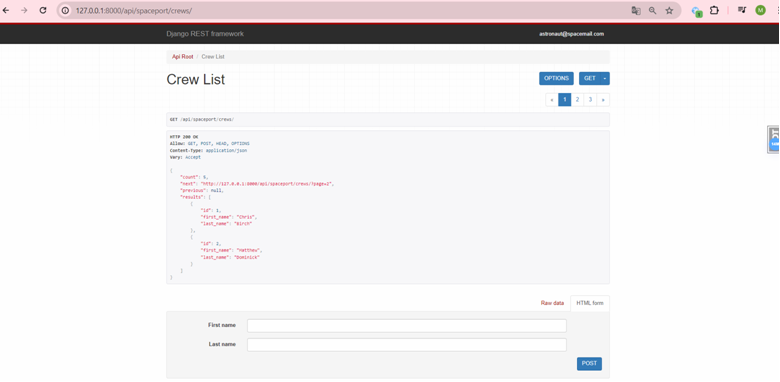

4. Crew instance page.

   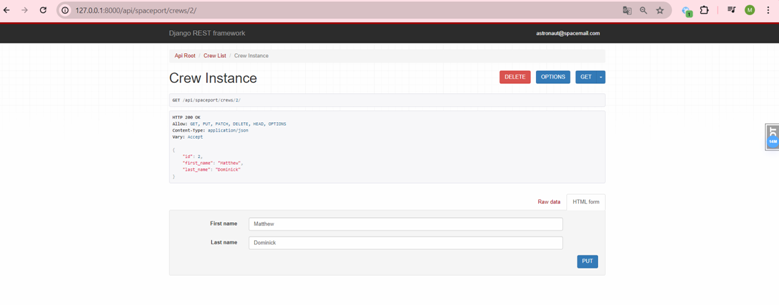

5. Spaceship list page.

   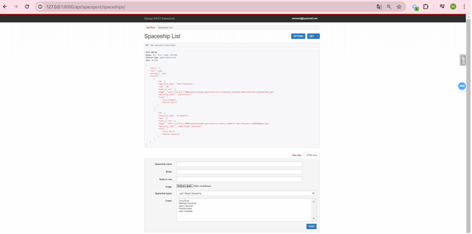

6. Spaceship instance page.

   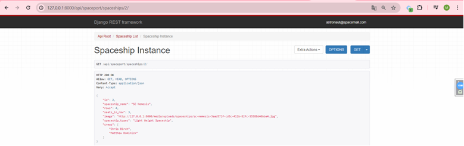

7. Upload image page.

   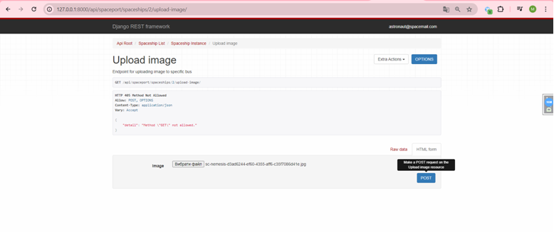

8. Planet list page.

   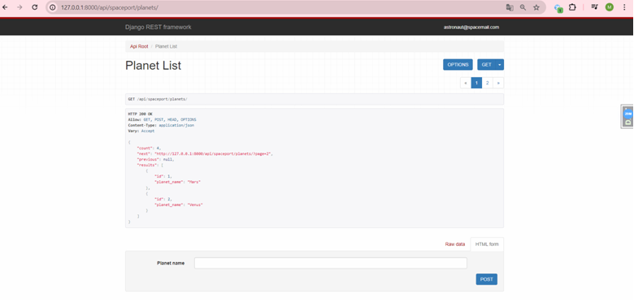

9. Planet instance page.

    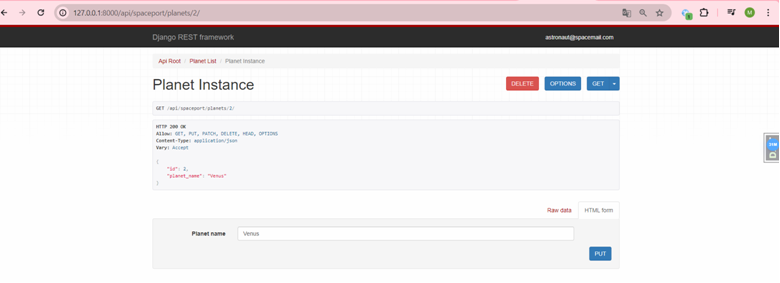

10. Spaceport list page.

   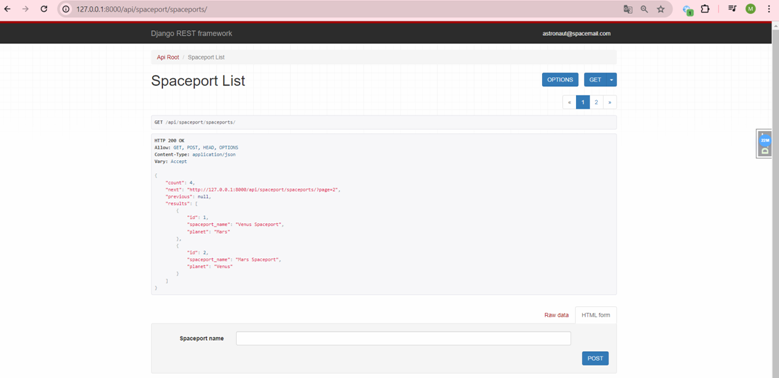

11. Spaceport instance page.

   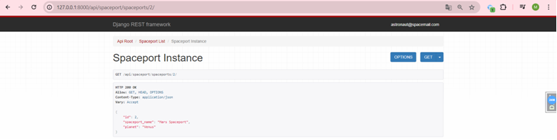

12. Route list page.

   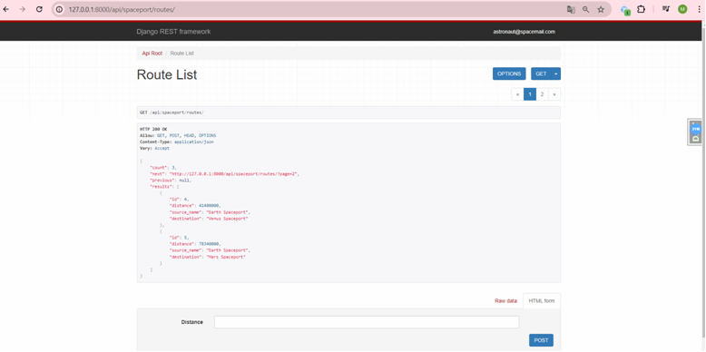

13. Route instance page.

  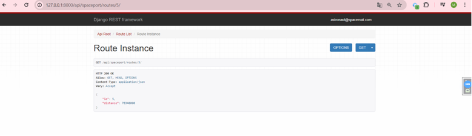

14. Spaceflight list page.

   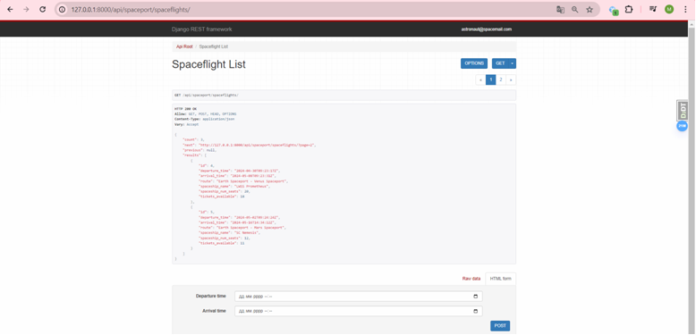

15. Spaceflight instance page.

   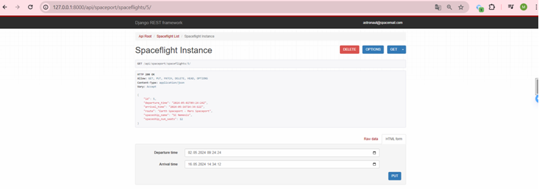

16. Order list page.

   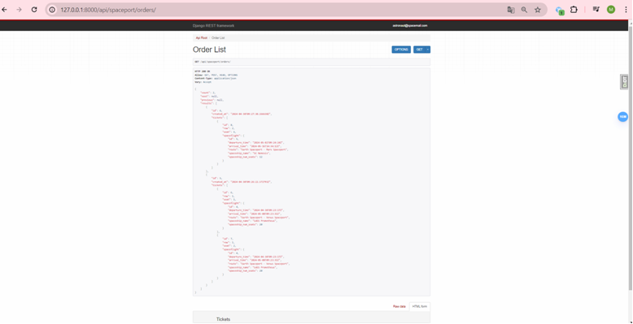

17. Order instance page.

   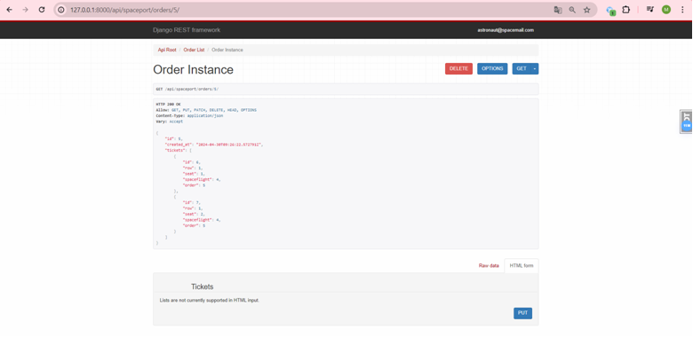

18. Spaceship list page with crew filtering.

   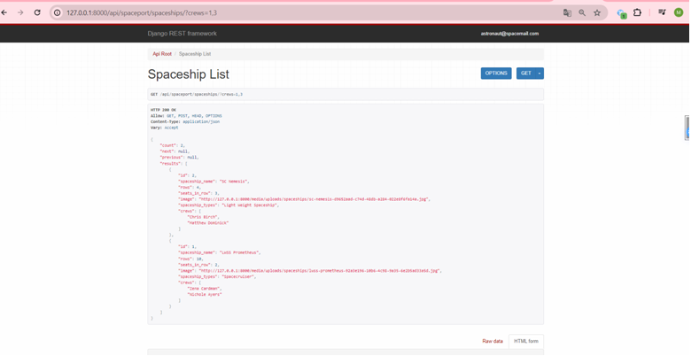

   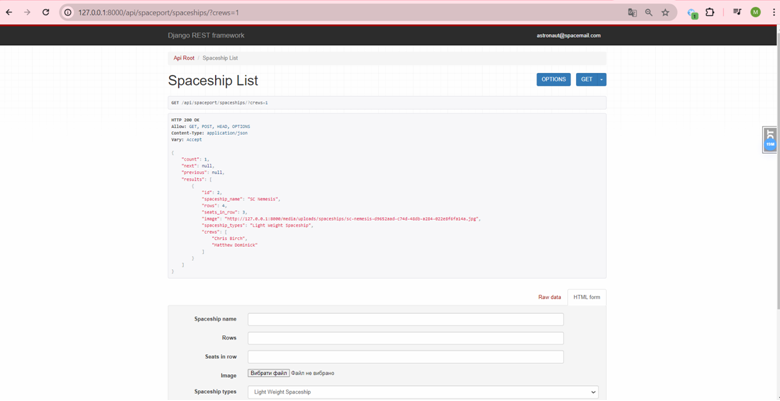

   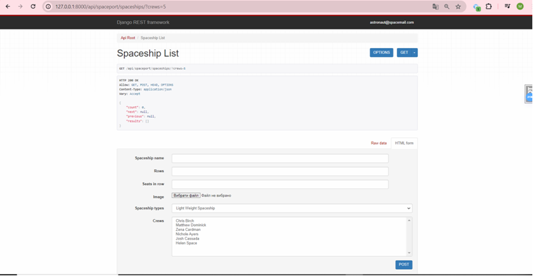
